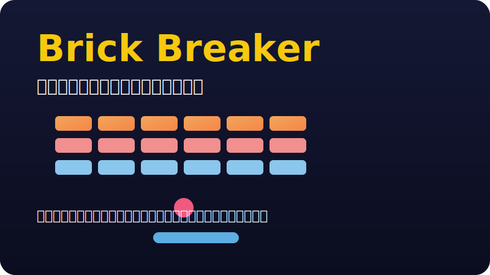

# CodexTest Brick Breaker

## 概要
CodexTest Brick Breaker は、クラシックなブロック崩しをベースにしたブラウザゲームです。ボールを落とさないようにパドルを操作し、画面上部に並ぶレンガをすべて破壊するとステージクリアとなります。短時間で遊べるアーケードスタイルのゲームなので、ちょっとした息抜きや反射神経のトレーニングにも最適です。

## 主な特徴
- **スピード感あるプレイ体験**：ボールのバウンドとパドル操作でリズム良くレンガを破壊できます。
- **直感的な操作**：マウスまたはタッチ操作（ドラッグ）でパドルを左右に移動するだけのシンプルな操作性。
- **スコアシステム**：レンガを壊すごとにスコアが加算され、高スコア更新を目指せます。
- **シンプルなUI**：視認性の高いインターフェースと軽快なアニメーションで、誰でもすぐに遊べます。

## 遊び方
1. パドルを左右に動かし、ボールを落とさないようにしましょう。
2. ボールをレンガに当てると破壊でき、スコアが入ります。
3. すべてのレンガを壊すとステージクリア。ボールを落とすとライフが減り、ライフがなくなるとゲームオーバーです。

## 操作方法
- **マウス**：マウスカーソルを左右に動かすかドラッグしてパドルを操作
- **タッチデバイス**：画面下部を左右にスワイプしてパドルを操作

## ここから遊べるよ
- [ここから遊べるよ（ローカル環境）](./index.html)：リポジトリをクローンした後、ブラウザで `index.html` を開いてください。

## 開発者向けメモ
- エントリーポイント：`index.html`
- ゲームロジック：`src` ディレクトリ配下（`src/app.js`、`src/presenter/`、`src/view/` など）
- スタイル：`src/style.css`

ブラウザのみで動作するため、特別なビルド手順は不要です。`index.html` をブラウザで開くだけですぐにデバッグを始められます。
